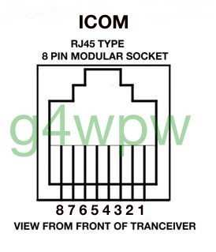
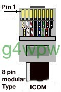
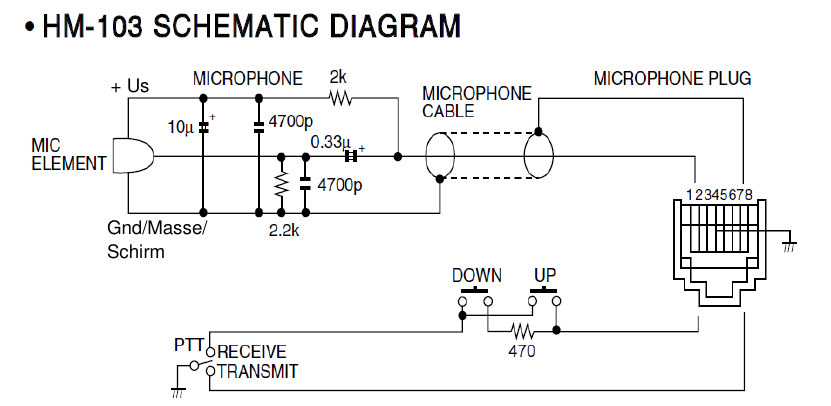

# Zwei-Ton-Generator - DARC F07 Project (c) DG3QQ

#####  Doc-Rev: 20240219-2120

#  Baumappe - Anhang

## Mikrofon-Anschluß f. ICOM IC-706 u.ä.

## 
| PIN  | Signal       | Farbe |
| :---: | ----------- | --- |
| 1 | +8V !!max. 10mA | rot   |
| 2 | UP/DOWN         | blau  |
| 3 | AUDIO OUT       | n/a   |
| 4 | PTT             | gelb  |
| 5 | MIC GROUND      | grau  |
| 6 | MIC             | weiss |
| 7 | GROUND/EARTH    | grün  |
| 8 | SQUELCH         | braun |
  
>note +8V nicht strombegrenzt - Bei Überstrom TRX kaput !
 

### ICOM HM103

[g4wpw](https://www.qsl.net/g4wpw/date.html)

