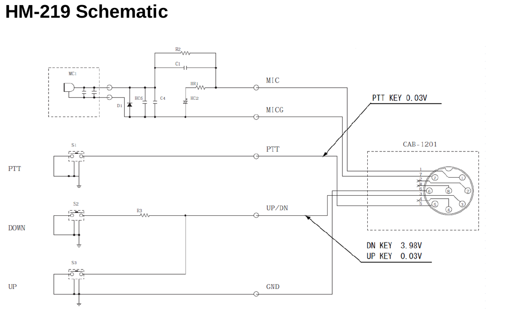

# Zwei-Ton-Generator - DARC F07 Project (c) DG3QQ

#####  Doc-Rev: 20240219-2300

#  Baumappe - Anhang

## Mikrofon-Anschluß f. ICOM IC-7300 

## 
| PIN   | Signal | Farbe |
| :---: | ----------- | --- |
| 1 | MIC             |     |
| 2 | +8V             |     |
| 3 | MIC_U/D         |     |
| 4 | SQL             |     |
| 5 | PTT             |     |
| 6 | GND             |     |
| 7 | MICE            |     |
| 8 | AF_OUT          |     |
  
>note +8V 10mA max.
 
 

### ICOM HM-219

[g4wpw](https://www.qsl.net/g4wpw/date.html)

## microphon input specs

impedance: 600Ohm
pegel: (von service manual addendum; 4-4 TX POWER ADJUSTMENTS) Level : 30 mVrms

