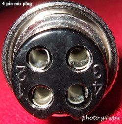

# Zwei-Ton-Generator - DARC F07 Project (c) DG3QQ

#####  Doc-Rev: 20240219-2120

#  Baumappe - Anhang

## Mikrofon-Anschluß f. KENWOOD TS-700G u.ä.

## 
| PIN  | Signal |
| :---: | --- |
| 1 | MIC |
| 2 | PTT |
| 3 | PTT GND |
| 4 | MIC GND |
    
    

### kenwood MC-10

[g4wpw](https://www.qsl.net/g4wpw/date.html)

