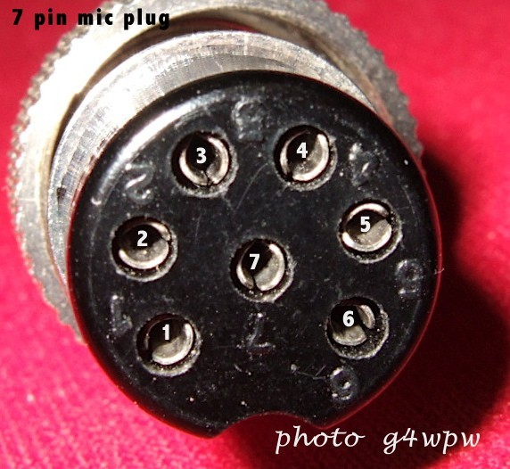
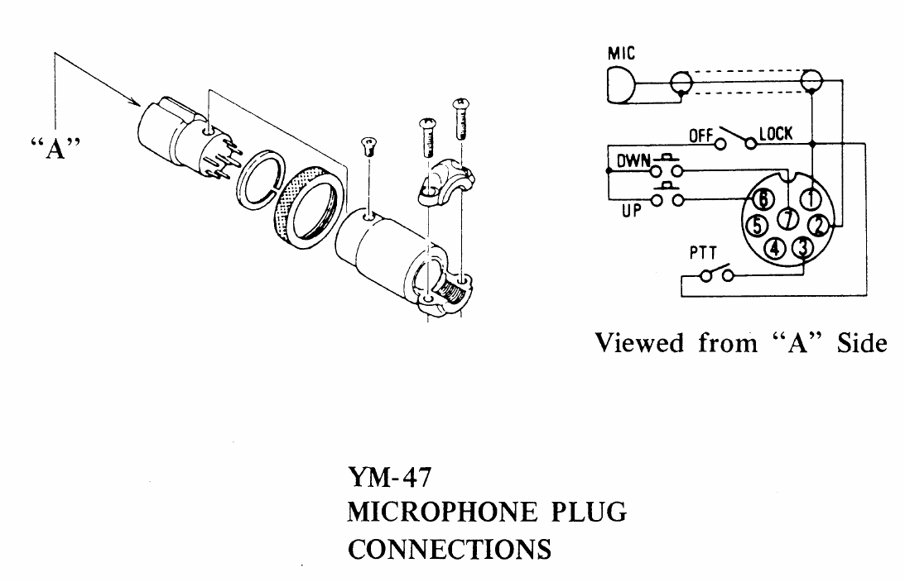
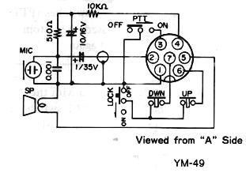

# Zwei-Ton-Generator - DARC F07 Project (c) DG3QQ

#####  Doc-Rev: 20240219-2120

#  Baumappe - Anhang

## Mikrofon-Anschluß f. YAESU FT-290R u.ä.

## 
| PIN  | Signal |
| :---: | --- |
| 1 | MIC Schirm/Masse |
| 2 | MIC |
| 3 | PTT |
| 4 | + 12VOLT ( + 5 VOLTS FT730-FT290R ) |
| 5 | SPEAKER |
| 6 | UP |
| 7 | DOWN |
    
    

### yaesu YM-47

### yaesu YM-49

[g4wpw](https://www.qsl.net/g4wpw/date.html)

