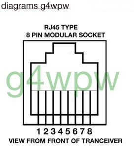
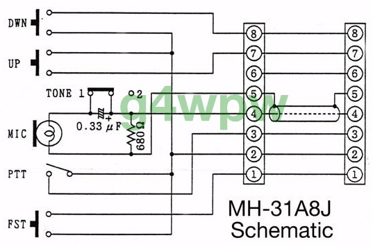
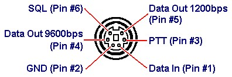

# Zwei-Ton-Generator - DARC F07 Project (c) DG3QQ

#####  Doc-Rev: 20240219-2120

#  Baumappe - Anhang

## Mikrofon-Anschluß f. YAESU FT-817 u.ä.

## 
| PIN   | Signal      | Farbe           |
| :---: | ----------- | --------------- |
| 1     | FAST SCAN.  | rot (red)       |
| 2     | GROUND.     | braun (brown)   |
| 3     | PTT.        | gelb (yellow)   |
| 4     | MIC.        | weiss (white)   |
| 5     | MIC GROUND. | schwarz (black) |
| 6     | + 5 VOLTS.  | grün (green)    |
| 7     | UP.         | blau (blue)     |
| 8     | DOWN.       | schwarz (black) |    

    

### yaesu HM-31A8J

### yaesu MH-31 Specifications
+ Microphone Element: Dynamic
+ Audio Tone Response: Tone 1 Full range. Tone 2 -14dB ±3 dB at 100 Hz
+ Sensitivity: -78 dB ±3dB at 1 kHz
+ Microphone Impedance: 190 Ohms ±30% at 1 kHz (Tone 1)
+ Dimensions: 2.5 x 4.5 x 1.25 inches
+ Weight: 7 ounces (183 g). 

[g4wpw](https://www.qsl.net/g4wpw/date.html)

## yaesu 6-pin mini-DIN (FT-817)
| PIN  | Signal |
| :---: | --- |
| 1 | Data In (1Vpp; 10kOhm)|
| 2 | GROUND |
| 3 | PTT |
| 4 | Data Out 9600bps |
| 5 | Data Out 1200bps (300mVpp; 10kOm)|
| 6 | SQL |

6-pin mini-DIN (FT-817) DATA port  

