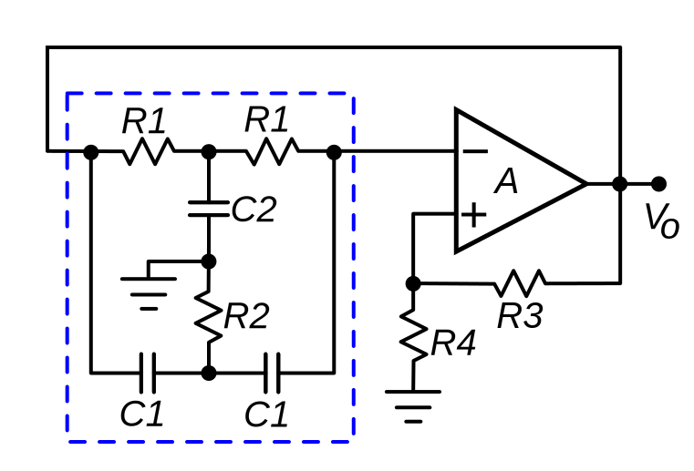
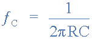

# Zwei-Ton-Generator - DARC F07 Project (c) DG3QQ

#####  Doc-Rev: 20240205-1257

#  Baumappe - Kapitel 1

## Schaltungsbeschreibung

### Überblick / Blockdiagramm

Wie im obigen Blockdiagramm dargestellt, besteht der beschriebene Zweiton-Generator aus zwei Oszillatoren mit jeweils einem nachgeschalteten Tiefpass. Die Frequenzen sind mit RV1 bzw. RV2 in gewissem Maße einstellbar. 

Danach werden die beiden NF-Sinus-Signale in einer passiven Mischstufe (RV3) einander überlagert.

Abschließend folgt eine Impedanzwandler-/Puffer-Stufe (T3). In deren Auskopplung ist auch ein Abschwächer vorhanden.

Nachfolgend werden die einzelnen Stufen näher beschrieben. 

#### Oszillator-Schaltung

Als Oszillator-Schaltung kommt hier die "Twin-T"-Konfiguration mit einem NPN-Transistor als Verstärker zum Einsatz.

Andere Oszillator-Schaltungen, wie z.B. Wien-Brücke, Phasen-Netzwerk o. andere, erfordern mehr Aufwand an Bauteilen/Schaltung-Komplexität. Oder sind nicht geeignet mit einfachen Mitteln, innerhalb eine Oktave nach oben oder unten verstimmt/eingestellt zu werden. 

{width=400}

[wikipedia: Twin-T_oscillator](https://en.wikipedia.org/wiki/RC_oscillator#Twin-T_oscillator)

Der Oszillator besteht aus einem Verstärker und einem Rückkopplung-Netzwerk. 

In diesem speziellen Fall ist es eine Parallelschaltung von RCR-Tiefpass und CRC-Hochpass in T-Anordnung

Mit :
R1 = R; R2 = 1/2 * R und

C1 = C; C2 = 2 * C

Gilt für die Bestimmung der Frequenz:

Durch Variation von Widerstand (R2) ist es, in begrenztem Maße möglich, die Resonanzfrequenz zu ziehen; Plus/Minus eine halbe Oktave geht.

Viel tiefer in die Funktionsweise der "Twin-T"-Oszillatorschaltung möchte ich hier aber nicht weiter eingehen. -> [elektronik-labor. de - Eintransistor-Sinusoszillator (www.elektronik-labor.de/Notizen/SinusOsz.html)](https://www.elektronik-labor.de/Notizen/SinusOsz.html)

Halbleiter-Schaltungstechnik, Tietze, Ulrich; Schenk, Christoph; Springer-Verlag  

#### Tiefpass-Filter

Eine "Twin-T"-Oszillatorschaltung ist gegenüber einem *Wien*-Oszillator mit einem höheren Klirrfaktor behaftet. Dem wird hier mit passiven (RC)-Tiefpass-Filtern in ausreichender weise entgegen gewirkt.

#### NF-Überlagerung / Mischer u. Balance Einstellung

Die Überschrift für diese Stufe erscheint komplizierter als es ist.

Die NF-Signale der vorausgehenden Stufen werden an die gegenüberliegenden Enden  eines Potentiometer eingespeist. An dessen Abgriff bildet sich dann das Überlagerung-Signal.

Je nach Eingang-Amplitude und Stellung des Abgriff wird hier (mit VR3) die *Balance*
der beiden Tonsignale im Verhältnis 1:1 eingestellt.

#### Puffer-/Impedanzwandler-Stufe

Eigentlich könnte man hier aufhören und das Signal an dieser Stelle ausleiten. 

Es ist jedoch sinnvoll hier eine  niederohmige Impedanz-/Puffer-Stufe (T3) vorzusehen. 

#### Spannungsversorgung

Da das Gerät für den ungebundene Einsatz konzipiert wurde, sind zur Versorgung Primär-Zellen (3xAAA) vorgesehen.

Die Spannung-Stabilisierung erfolgt durch eine "Shunt"-Schaltung. Eine LED (blau; ø3mm) wird als Referenz eingesetzt. Zusätzlich dient diese LED auch als Betrieb-Anzeige.

#### Funktionskontrolle

Bezüglich der Funktion-Kontrolle muss hier besonders auf die Verwendung der Kontakte der beiden Schalter hingewiesen werden.

Zum einen verbinden diese jeweils den Negativ-Batterie-Anschluss mit der Schaltung (ODER Verknüpfung).

Zum anderen kann der Kondensator im Tiefpasszweig am "Twin-T"-Oszillator gegen Masse gebrückt werden (aus). 

Auf diese weise wird möglich mit nur zwei einpoligen Umschaltern (SPST) folgendes Funktion-Verhalten zu erreichen.
 
| S1 | S2  | Stromversorgung | Ausgang (Frequenz) |
| --- | --- | :--- | --- |
| aus | aus | aus; Batterie nicht verbunden           | 0 |
| ein  | ein  | ein; Batterie verbunden              | f1 + F2 | 
| ein  | aus | ein; anderer Oszillator (f2) gesperrt | f1 | 
| aus | ein  | ein; anderer Oszillator (f1) gesperrt | f2 |

