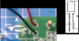
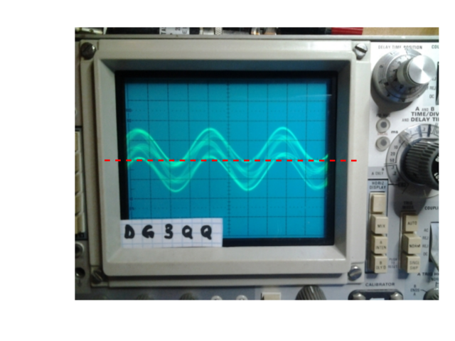

# Zwei-Ton-Generator - DARC F07 Project (c) DG3QQ

#####  Doc-Rev: 20240224-1440

# Baumappe - Kaptel 2

## Bestückung-Anleitung des PCB

Nachfolgend werden detailliert die Schritte der Bestückung der Platine beschrieben.

Bitte folgen Sie der gegebenen Reihenfolge, denn diese haben sich als sinnvoll und praktikabel erwiesen.

### Bestand-Aufnahme
Bevor es an's Bestücken geht, hat es sich immer als sinnvoll erwiesen, die Vollständigkeit der Materialien zu prüfen.

Bitte identifizieren und prüfen Sie anhand der [Stückliste](ad_bom_sum.md) die Bauteile. Und stellen Sie sicher, dass alle vorhanden sind.

Sortieren sie die dabei die Widerstände. Unter Umständen sind einige der Farbringe nur schwer zu identifizieren; wenn nötig benutzen sie ein Vergrößerungsglas. Am besten benutzen sie ein Multimeter 
um die Werte zu überprüfen.

### Poti's, Schalter und LED zuerst
Die Poti's, Schalter und LED sollen von außen bedienbar bzw. sichtbar sein! 

Deshalb platzieren Sie die Poti's (VR1..VR3), Schalter (S1, S2) und die LED (LED1). Aber noch nicht einlöten! 

Bei der LED ist auf die Polarität zu achten. 

Richten Sie diese Bauelemente entsprechen aus und 'heften' (tack solder) Sie diese in Position. 

Wenn alles passt, können Sie die Poti's, Schalter und LED zuverlässig verlöten.

>!Note Leider konnten die im Labormuster verwendeten Sub-Miniatur-Schalter weder in dieser noch vergleichbaren Bauform (zum Termin) beschafft werden. Statt dessen werde funktionsgleiche aber etwas größere mit Litze-Drähten mit dem PCB verbunden.

### Und jetzt fertig bauen

Wer die Funktion der Schaltung verstanden hat, oder ein erfahrener *Nachbauer* ist, mag gerne die folgenden Anweisungen zur weiteren Bestückung der Platine überspringen und *In eigen Regie* weiter bauen. (Nict empfohlen) [->weiter zu Kapitel PCB_Fertig](#PCB_Fertig)

### Schritt für Schritt Anweisungen

Nachdem Sie jetzt VR1.. S1.. und LED1 platziert haben, 
fahren wir mit den den weiteren, Bauteilen fort:

#### Bestückung - Stromversorgung
Die LED1 wurde schon im vorhergehenden Schritt bestückt. Um den Stromversorgung-Teil zu vervollständigen, bestücken sie nun noch:

+ [_] R1 Widerstand 560R 0,25W stehend (grün-blau-braun). 
> !NOTE: Setzen Sie diesen, abweichend vom Bestückungsdruck in umgekehrter Weise ein. Dann kann am langen Ende zu Testzwecken per Laborklemme die Schaltung provisorisch mit *PLUS* der Batterie-Versorgung verbunden werden.

+ [_] C1 Kondensator 100nF (104)

##### Test - Stromversorgung
Jetzt kann ein erster Test dieses Schaltungsteil erfolgen.

Verbinden Sie vorübergehend die Batterie (oder eine vergleichbare Spannungsquelle) mit dem PCB. 

Durch betätigen der Schalter sollte sich folgendes ergeben:

| Schalter | LED | 
| :---      | :--- |
| beide aus | dunkel |
| mindestens einer oder beiden ein | leuchtet |

Wenn die LED in keiner der Stellungen leuchtet, prüfen Sie deren Polarität/Einbau.

#### Bestückung - Erster Oszillator

Bestücken Sie:

+ [_] Widerstand R2 47k liegend (gelb-vio-orange)
+ [_] Widerstand R4 47k stehend (gelb-vio-orange)
+ [_] Kondensator C4 10nF (103)
+ [_] Kondensator C4B 3,3nF (332)
+ [_] Kondensator C3 10nF (103)
+ [_] Kondensator C3B 3,3nF (332)
+ [_] Kondensator C2 22nF (223)
+ [_] Kondensator C5 1µF (105)
+ [_] Kondensator C6 22nF (223)
+ [_] Kondensator C7 22nF (223)
+ [_] Testpunkt TF1 (1x2 pinstrip Sockel (RM2.5))
+ [_] Widerstand R6 4k7 stehend (gelb-vio-rot)
+ [_] Widerstand R7 4k7 stehend (gelb-vio-rot)
+ [_] Transistor T1 NPN-Transistor 2N3904 (o.ä.) 
> Eventuell müssen die Beinchen etwas gebogen werden, damit sie gut in die Bohrungen passen.

#### Bestückung - Zweiter Oszillator

Bestücken Sie:

+ [_] Widerstand R9 33k liegend (orange-orang-orange)
+ [_] Widerstand R10 33k stehend (orange-orang-orange)
+ [_] Widerstand R11 2k2 stehend (rot-rot-braun)
+ [_] Kondensator C9 4,7nF (472)
+ [_] Kondensator C10 4,7nF (472)
+ [_] Kondensator C8 10nF (103)
+ [_] Kondensator C11 1µF (105)
+ [_] Kondensator C12 3,3nF (332)
+ [_] Kondensator C13 3,3nF (332)
+ [_] Testpunkt TF2 (1x2 pinstrip Sockel (RM2.5))
+ [_] Widerstand R12 10k stehend (braun-schwarz-orange)
+ [_] Widerstand R13 10k stehend (braun-schwarz-orange)
+ [_] Transistor T2 NPN-Transistor 2N3904 (o.ä.) (Beinchen biegen)
+ [_] Testpunkt SG (1x2 pinstrip Sockel (RM2.5))

####Bestückung - Ausgang-Puffer-Stufe

Bestücken Sie:

+ [_] Widerstand R20 10k stehend (braun-schwarz-orange)
+ [_] Widerstand R21 10k stehend (braun-schwarz-orange)
+ [_] Widerstand R22 560R stehend (grün-gelb-braun)
+ [_] Widerstand R26 27k stehend (rot-vio-orange)
+ [_] Widerstand R24 5k6 stehend (grün-gelb-rot)
+ [_] Widerstand R25 560R stehend (grün-gelb-braun)
+ [_] Widerstand R23 560R stehend (grün-gelb-braun)
+ [_] Testpunkt  SIG_ (1x3 pinstrip Sockel (RM2.5))
+ [_] Kondensator/Elko C15 10µF radial (Polarität beachten)
+ [_] Kondensator/Elko C16 220µF radial (Polarität beachten)
+ [_] Transistor T3 NPN-Transistor 2N3904 (o.ä.) (Beinchen biegen) 

## PCB Fertig

Sie haben die Platine fertig bestückt. Zum Abschluss nun noch den Batteriehalter verbinden und drei Batterien (Typ-AAA) einlegen.

Nun kann getestet und eingestellt werden.

Am besten prüfen Sie die Funktion mit einem Oszilloskop.

+ [_] Stellen Sie mit VR1 die Frequenz des Oszillator (um T1) auf typisch 700Hz ein.
+ [_] Stellen Sie mit VR2 die Frequenz des Oszillator (um T2) auf typisch 1900Hz ein.
+ [_] Regeln Sie mit VR3 die *Balance* der beiden Signale so, dass sie im Gemisch gleiche Amplitude haben.
Siehe [Benutzer-Anleitung](om_benutzer_anleitung.md) 

### 
