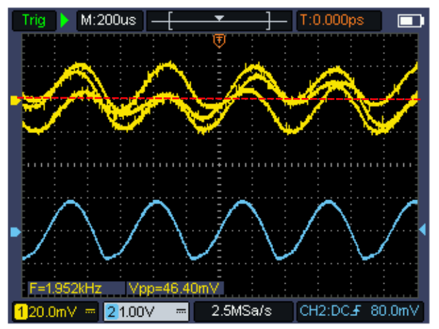

# Zwei-Ton-Generator (c) DG3QQ

#####  Doc-Rev: 20240219-2300

## Benutzeranleitung

Welche Frequenzen für den AF-Zwei-Ton-Generator?. Wichtig ist, [VK5JST] daß diese nicht in einem *harmonischen* Verhältnis zueinander stehen.

+ F1 nicht ganzzahlig Vielfaches oder Teil von F2
+ Oberwellen/-Töne von F1 nicht ganzzahlig Vielfaches oder Teil von F2 oder deren Oberwellen/-Töne
+ Abstand von ca. 300Hz von den Eckfrequenzen des Übertragungsbandes

Das *AARL Test Procedures Manual*, als auch viele andere Veröffentlichungen, benutzen für die zwei Töne die Frequenzen von 700Hz und 1900Hz.

### frequencies used
| source | f1 | f2 | comment |
| :--- | :---: |  :---: |  :--- |
| AARL Test Procedures Manual | 700 | 1900 | |
| VK5JST | 600 - 700 | 1800 - 2000 |  i.e. about 300Hz from either end of the audio pass band |
| vk6ysf |   700 | 1900 | |
| vk4znc |   800 | 1800 | |
| dk7ih  |   800 | 1350 | |
| dk7ih  |   850 | 2200 | |
| dc4ku  | 1350 | 1900 | |
| dc4ku  | 1075 | 1500 | |
| dl6gl  |  700 | 1900 | |
| gw3spa |  700 | 1900 | |
| ttg2 hendriks | 700 | 1900 | |
| ttg1 preciserf | 700 | 1900 | |
| TwoTone_v2s qrpkits |  750 | 1900 | |
| f6cer  | 1000 | 1300 | |
| f2dc   |  720 | 1890 | |
| pc2c   | 1000 | 1300 | |
| motorola note | 1000 | 1800 | |

## Einstellung
### Frequenz(en)
Stellen Sie die beiden Oszillatoren auf die gewünschten Betrieb-Frequenzen (Typ 700Hz und 1900Hz) ein.

### Amplituden (Balance)

Die Amplitude der beiden Sinus-Signale muss gleich sein.

#### Einstellung mit dem Oszilloskop

Eingang CH1 mit dem Ausgang des Generator verbinden.

Um ein stehendes Bild zu erreichen verbinde man einen der Testpunkte (TF1 o. TF2) mit dem zweiten Kanal des Oszilloskop oder dessen extern Trigger-Eingang und stell das so ein.

##### TEKTRONIX 645 

##### UNI-T DSO 
 

#### Einstellung mit dem PC/Laptop und FFT-Analizer

Ich schlage hier DL4YHF's Spectrum Lab (Audio Signal Analyser) vor.

>Note: Beachten Sie, daß der Mikrofon-Eingang hier für die Verwendung von Elektret-Mikrofonen ausgelegt ist. Prüfen sie ob die Phantom-Speisung separat geführt ist und/oder ein DC-Block-Kondensator dann erforderlich wird.

Verbinde den Ausgang des Generator mit dem PC-Sound-Interface.

Stelle die Parameter der verwendeten Software ein.

In dem dargestellte FFT-Diagramm sollten nun die beiden Grund-Töne von Oszillator F1 (mittels VR1) und F2 (mittels VR2) auf die gewünschte Arbeitsfrequenz eingestellt werden. Danach wird über VR3 die Magnitude der beiden Signale auf Gleichheit eingestellt.

## Messaufbau 
Ich muss Sie hier mehr oder weniger alleine lassen. 

Es war nicht und wird es auch nicht sein, mit dem hier beschriebenen AF-Zweiton-Generator die Aspekte der RF-Messtechnik zu vermitteln.
Zum einen gibt es einige gute Artikel hierzu; zum anderen sei unbedingt auf die technische Dokumentation des Gerätes (TRX) verwiesen.

